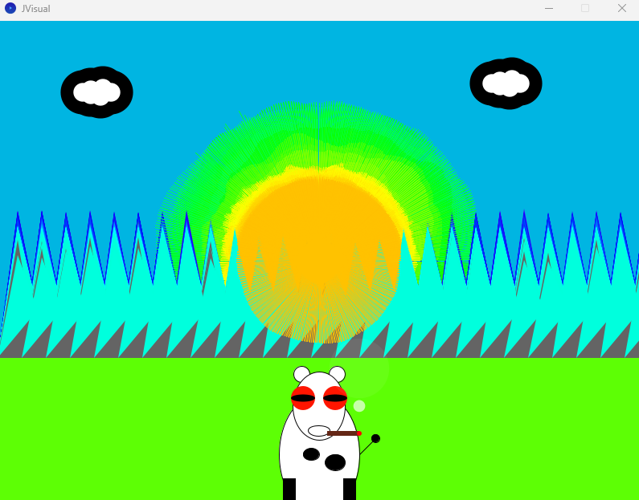

# Music Visualiser Project

Names: Oisin Cruise, Conor Fee, Mark Langan, Jake Walsh

Student Number: C22517166, C22414306, C22470414, C22493266

Song: stayinit by Fred again

# Description of the assignment
4 visuals baded on the song stayinit
-Interactive X design, 

# Instructions

# How it works
For Marks(C22470414) Visual:
Class Declaration: This is the main class of the program, named "test". It extends a class called "Visual".
Variables: Various variables are declared to hold data like audio amplitude, sizes, colors, and timing information.
settings(): This method sets up the size and rendering mode of the window.
setup(): This method initializes the program. It sets up audio processing, loads an audio file, initializes arrays, sets initial values for visual elements.
draw(): This method is the main loop of the program. It checks if an introductory animation is done. If not, it runs the introduction. If the intro is done, it processes the audio, calculates amplitudes, adjusts the visual elements based on the music, draws the visuals, and manages audio playback timing.
intro(): This method handles the introduction animation, displaying text on the screen with fading effects.
drawXShape(): This method draws X shapes on the screen. It adjusts the thickness and color of the lines based on parameters passed to it.
The program essentially listens to music, analyzes its characteristics, and creates visual patterns based on that analysis. It also includes an introduction animation at the beginning.

For ConorVisual : C22414306

ConorVisual.java uses the Minim library for audio processing and the Processing library for rendering graphics. This visualiser creates a dynamic spiral of circles that react to the music being played.
The ConorVisual class extends the Visual class from the ie.tudublin package, inheriting its properties and methods. The key components of this class include: *Audio Processing, Display Setup and Drawing and Visualisation.*
For the Audio Processing, The Minim library is used to handle audio input and playback. An AudioPlayer object (ap) is initialised to load and play an MP3 file ("stayinit.mp3").
The audio buffer (ab) is retrieved from the audio player to access real-time audio data.
For the Display setup, The settings method configures the display to be full-screen with 3D rendering enabled. The setup method initializes the Minim instance, loads the audio file, and sets up the color mode and initial buffer values.
For the Drawing and Visualisation, The draw method is the core rendering loop that executes repeatedly. It processes the audio data and updates the visual representation. Audio data is smoothed and stored in *lerpedBuffer* to create a more fluid visual effect.
The visual mode (mode 0, switch statement used for testing purposes) generates a spiral of circles. This involves: Mapping audio data to circle sizes and colors. Calculating the position of each circle using polar coordinates (angle and radius). Drawing circles with colors mapped to the hue spectrum, creating a vibrant, responsive spiral.
The spiral visualization is achieved through a loop that iterates over the audio buffer:
Radius and Angle Calculation: Each circle's position is determined by incrementing the radius (radiusStep) and angle (angleStep).
Color Mapping: Each circle's color is determined by mapping its index to the hue spectrum, ensuring a diverse range of colors.
Circle Drawing: The ellipse function is used to draw each circle at the calculated position, with its size proportional to the audio buffer's amplitude.
This setup results in a dynamic, colorful spiral of circles that pulsate and change in response to the music, providing an engaging visual experience synchronized with the audio.

For JVisual : C22493266

In this work, I implemented an interactive audio-visual piece using Minim audio library for sound analysis and Processing for visualization. The program interprets audio data in the form of dynamic graphics such as mountains, clouds, cows, mushrooms, and other animations reacting to the sound. The main goal has been to know more about how sound analysis can be used to drive real-time visual effects; at the same time, trying to provide an engaging and captivating user experience. The main player class JVisual extends the parent class Visual and overrides a number of methods to implement the audio input setup, the visual element drawing, and the mouse interaction.
Initializing the Minim library is done in the setup method. At the time of initiation, audio is loaded from file and played back at a given point. Audio buffer is then used for analyzing audio data. The average amplitude of the audio data is calculated to affect visual elements. This will ensure that the visuals are reacting in real time to changes within the audio track.
I have a few different types of music-visual interactions:
    -In case of need drawing the mountains and shadows: I need to draw mountains mountain and shadow translation. Both procedures compute the average amplitude of the audio data, but they manage the height and the color of the mountains in a dynamic way.

    -The drawFields method is responsible for drawing the fields at the screen bottom. I draw that with nothing but a simple rectangle.

    -The drawCow plots a cow with an ear, eye, and joint features. All scales are influenced by the audio data.

    -The drawShroom plots the mushrooms with the cap color influenced by the audio data.

    -The clouds and cloudShadow methods plot the clouds and their shadows. The cloud positions are stored in an array list and a new cloud is added when the mouse is clicked. This makes it interactive and allows the user to draw different shapes and bigger clouds when placing them near eachother

    -The Smoke class manages the smoke animation. This is what pretty much makes the whole thing dynamic and interactive. The smoke particles rise, get bigger, and fade out at the same time. In the draw method, I update and display each smoke particle and remove it if it has risen out of the screen. New smoke particles are added after a few clock ticks.

My visualisation is simple and fun as it is a collection of layered shapes which change colour and scale on audio inputs. I am very happy with how it turned out and I can honestly my understanding on the interactions between objects and why it works the way it does has improved hugely.

# What I am most proud of in the assignment
(c22470141)Being able to use my knowlegde of java to create art, based on music and not just answer questions on a paper.

C22414306 :  
A proud achievement for this project is to integrate a successful real-time audio processing with dynamic visual rendering, creating a visually captivating and responsive music visualiser. 
Through this work, I learned how to synchronize audio data with graphical elements, improving my skills in both audio manipulation and creative coding with the Minim and Processing libraries.

C22493266 :
My proudest feature in my visualiser is the smoking cow, I created it entirely by myself at the end when i had created everything else. It is an accumulation of all the knowledge and techniques I had learned from researching and experimentation.

# Stayinit Music Visual Video

